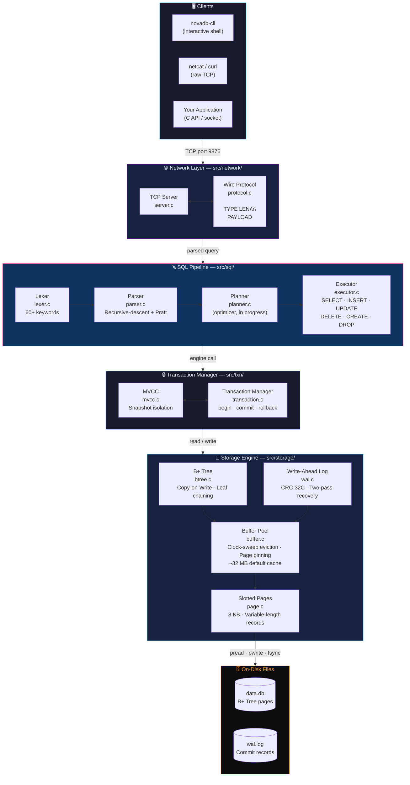
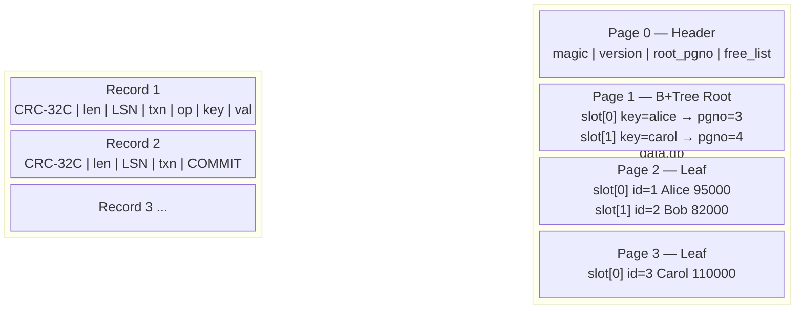

<br>
<div align="center">

<a href="https://razorpay.me/@CodeChap?amount=kXxURMaXFk%2Bmrv%2B9uGrYpg%3D%3D">
  
</a>

<br><br>

# NovaDB

**A full SQL database engine, written from scratch in C.**

[](https://github.com/Saff9/NovaDB/actions/workflows/ci.yml)
[](https://github.com/Saff9/NovaDB/actions/workflows/security.yml)
[](LICENSE)


> *If this project saved you time, taught you something, or just impressed you — a coffee goes a long way. Thank you.* ☕

</div>

---

NovaDB is an ACID-compliant SQL database engine built entirely from first principles.
No third-party libraries. No ORMs. No generated code. Just C11, POSIX, and a lot of careful thinking.

It speaks SQL over TCP, persists data safely through crashes, handles concurrent readers and writers with snapshot isolation, and fits the entire storage engine, query parser, and network server in under 7,000 lines of readable code.

If you've ever wondered how a database actually works — what lives below the SQL, below the query planner, all the way down to the bytes written to disk — NovaDB is designed to be that answer.

---

## Table of Contents

- [What's Inside](#whats-inside)
- [Quick Start](#quick-start)
- [SQL Reference](#sql-reference)
- [Architecture](#architecture)
- [Design Decisions](#design-decisions)
- [Project Structure](#project-structure)
- [Building](#building)
- [Deploying](#deploying)
- [Embedding](#embedding)
- [Comparison](#comparison)
- [Contributing](#contributing)
- [License](#license)

---

## What's Inside

NovaDB implements every layer of a real database from scratch:

| Layer | Files | Description |
|---|---|---|
| **Slotted Pages** | `storage/page.c` | 8 KB pages with variable-length slot directory — the same design used by PostgreSQL |
| **B+ Tree** | `storage/btree.c` | Copy-on-write, leaf chaining, key ordering — the primary storage structure |
| **Buffer Pool** | `storage/buffer.c` | Clock-sweep eviction with page pinning — keeps hot pages in memory |
| **Write-Ahead Log** | `storage/wal.c` | CRC-32C integrity, two-pass crash recovery, append-only writes |
| **MVCC Transactions** | `txn/transaction.c` | Snapshot isolation — readers never block writers, writers never block readers |
| **SQL Lexer** | `sql/lexer.c` | 60+ keywords, string escaping, line and block comments |
| **SQL Parser** | `sql/parser.c` | Recursive-descent + Pratt expression parser, full WHERE clause support |
| **SQL Executor** | `sql/executor.c` | SELECT · INSERT · UPDATE · DELETE · CREATE TABLE · DROP TABLE |
| **TCP Server** | `network/server.c` | epoll on Linux, poll(2) on macOS/BSD, non-blocking I/O throughout |
| **Wire Protocol** | `network/protocol.c` | Text-framed, JSON responses — debug with plain netcat |
| **CLI Client** | `contrib/novacli.c` | Interactive SQL shell, readline support |
| **Public C API** | `include/novadb/` | Clean embeddable API — use NovaDB as a library in your own program |

**~6,800 lines of C across 38 files.** Every line is readable and documented.

---

## Quick Start

You need a C compiler and Make. That's it.

```bash
git clone https://github.com/Saff9/NovaDB.git
cd NovaDB
make release
```

Start the server:

```bash
./bin/novadb-server --data-dir ./data --port 9876
```

Connect with the built-in shell:

```bash
./bin/novadb-cli
```

Or with plain netcat if you want to see the raw wire protocol:

```bash
echo -e "QRY 27\r\nSELECT 1 + 1 AS result" | nc localhost 9876
```

---

## SQL Reference

NovaDB understands a practical subset of standard SQL. Here's what you can do today:

### Creating a table

```sql
CREATE TABLE employees (
    id       INTEGER  PRIMARY KEY,
    name     VARCHAR(255) NOT NULL,
    role     VARCHAR(100),
    salary   FLOAT    DEFAULT 0.0
);
```

### Inserting rows

```sql
INSERT INTO employees (id, name, role, salary)
VALUES (1, 'Alice', 'Engineer', 95000);

INSERT INTO employees (id, name, role, salary)
VALUES (2, 'Bob', 'Designer', 82000);

INSERT INTO employees (id, name, role, salary)
VALUES (3, 'Carol', 'Engineer', 110000);
```

### Querying

```sql
-- All rows
SELECT * FROM employees;

-- Specific columns with a condition
SELECT name, salary FROM employees WHERE role = 'Engineer';

-- With ordering and a limit
SELECT name, salary FROM employees
ORDER BY salary DESC
LIMIT 10;
```

### Updating and deleting

```sql
UPDATE employees SET salary = 98000 WHERE name = 'Alice';

DELETE FROM employees WHERE id = 2;
```

### Transactions

```sql
BEGIN;
INSERT INTO employees (id, name, role, salary) VALUES (4, 'Dave', 'PM', 105000);
UPDATE employees SET salary = salary + 5000 WHERE role = 'Engineer';
COMMIT;
```

### Cleanup

```sql
DROP TABLE employees;
```

---

## Architecture

NovaDB is structured as a clean vertical stack. Each layer has exactly one responsibility and communicates only with the layers directly above and below it.



### Data flow — what happens when you run a query

```mermaid
sequenceDiagram
    autonumber
    actor User
    participant CLI as novadb-cli
    participant NET as TCP Server
    participant LEX as Lexer
    participant PAR as Parser
    participant EXEC as Executor
    participant TXN as Txn Manager
    participant BT as B+ Tree
    participant WAL as WAL
    participant DISK as Disk

    User->>CLI: SELECT name FROM users WHERE id = 1
    CLI->>NET: QRY 38\r\n<query>
    NET->>LEX: tokenise
    LEX-->>PAR: token stream
    PAR-->>EXEC: AST (SELECT node)
    EXEC->>TXN: begin snapshot
    TXN-->>EXEC: snapshot_id
    EXEC->>BT: search(key=1)
    BT->>DISK: pread page #3
    DISK-->>BT: 8 KB page data
    BT-->>EXEC: row { name: "Alice" }
    EXEC->>TXN: commit (read-only)
    EXEC-->>NET: RES JSON
    NET-->>CLI: {"rows":[["Alice"]],"count":1}
    CLI-->>User: Alice
```

### Storage layout on disk



---

## Design Decisions

A few choices that define how NovaDB works and why:

### Copy-on-Write B+ Tree

When a row is inserted or updated, NovaDB clones the path from root to the modified leaf, then atomically swaps the root pointer. Old pages are never modified in place. This means:

- **Readers never take locks** — they hold a snapshot of the root pointer and see a consistent view of the tree regardless of what writers are doing.
- **Crash safety is natural** — partial writes leave the old tree intact; the new root is only visible after the WAL record commits.

### Write-Ahead Log with CRC-32C

Every mutation is written to the WAL before it touches the B+ Tree. Each record carries a CRC-32C checksum. On restart, NovaDB scans the WAL and replays any committed transactions the B+ Tree didn't reflect. Truncated or corrupt records (from a crash mid-write) are silently ignored — the database picks up at the last safe point.

### Clock-Sweep Buffer Pool

The buffer pool holds recently-accessed pages in memory to avoid hitting the disk on every read. When memory is full and a new page needs to load, the "clock hand" sweeps through cached pages and evicts the first one that hasn't been used since the last sweep. It's O(1) per access and performs nearly as well as LRU on real database workloads, with far less overhead.

### Text Wire Protocol

The network protocol is intentionally simple:

```
QRY 27\r\nSELECT * FROM employees
```

`TYPE` `SPACE` `PAYLOAD_LENGTH` `\r\n` `PAYLOAD`

Responses are JSON. This means any language with a socket and a JSON parser can talk to NovaDB — no special driver needed. It also means you can debug queries with netcat, which has saved many hours of head-scratching.

### Zero Dependencies

NovaDB links against nothing except libc, pthreads, and the C math library. No OpenSSL, no Zlib, no Protobuf. The build is:

```bash
cc -std=c11 *.c -lpthread -lm -o novadb-server
```

This makes the binary trivial to distribute, the build trivially reproducible, and the supply chain risk essentially zero.

---

## Project Structure

```
novadb-c/
│
├── include/novadb/          # Public API — include this in your own code
│   ├── nvdb.h               # Core API: nvdb_open, nvdb_exec, nvdb_close
│   ├── types.h              # Shared types: NVDBValue, pgno_t, txnid_t, lsn_t
│   ├── error.h              # Error codes, nvdb_set_error, nvdb_strerror
│   └── nvdb_config.h        # Platform feature flags (epoll, fallocate, etc.)
│
├── src/
│   ├── engine.c             # Top-level engine: ties storage + SQL + transactions together
│   │
│   ├── common/
│   │   ├── memory.c/h       # Arena allocator (fast, scope-freed) + slab allocator
│   │   └── logging.c/h      # Level-gated timestamped logging to stderr
│   │
│   ├── storage/
│   │   ├── page.c/h         # Slotted 8 KB pages with binary-encoded headers
│   │   ├── btree.c/h        # Copy-on-write B+ Tree: insert, search, delete, leaf scan
│   │   ├── buffer.c/h       # Buffer pool with clock-sweep eviction and page pinning
│   │   └── wal.c/h          # Write-ahead log: append, sync, recover, checkpoint
│   │
│   ├── txn/
│   │   ├── transaction.c/h  # MVCC transaction manager: begin, commit, rollback, snapshot
│   │   └── mvcc.c/h         # Row-level visibility predicate (snapshot isolation)
│   │
│   ├── sql/
│   │   ├── lexer.c/h        # Tokeniser: keywords, identifiers, literals, operators
│   │   ├── parser.c/h       # Recursive-descent AST builder + Pratt expression parser
│   │   ├── executor.c/h     # Statement executor: walks AST, calls storage/txn APIs
│   │   └── planner.c/h      # Query planner stub (cost-based optimizer, in progress)
│   │
│   ├── network/
│   │   ├── server.c/h       # Non-blocking TCP server (epoll on Linux, poll on macOS)
│   │   └── protocol.c/h     # Wire protocol encode/decode
│   │
│   └── main.c               # Server entry point: arg parsing, signal handling, startup
│
├── contrib/
│   └── novacli.c            # Interactive CLI: connects to server, readline loop
│
├── test/
│   ├── test_main.c          # Test runner: prints pass/fail summary
│   ├── test_btree.c         # B+ Tree: insert/search/delete, 500-key stress test
│   ├── test_wal.c           # WAL: write, crash-simulate, recover, verify
│   ├── test_sql.c           # Lexer + parser: token correctness, AST shape
│   └── test_integration.c   # Full stack: CREATE → INSERT → SELECT → UPDATE → DELETE → DROP
│
├── Makefile                 # make release · make debug · make test
├── CMakeLists.txt           # CMake alternative for IDE integration
├── CONTRIBUTING.md          # How to contribute
├── HOSTING.md               # Deployment guide (systemd, Docker, bare binary)
├── SECURITY.md              # Security policy and vulnerability reporting
└── LICENSE                  # Apache License 2.0
```

---

## Building

### Prerequisites

- A C11 compiler: GCC 9+, Clang 11+, or Apple Clang 13+
- GNU Make (or CMake 3.20+ as an alternative)
- POSIX — Linux, macOS, or FreeBSD

### Make targets

```bash
make release    # Optimised build (-O2). Use this for production.
make debug      # Debug build with AddressSanitizer + UBSan. Use this for development.
make test       # Build and run the full test suite.
make clean      # Remove build/ and bin/.
```

### Running the tests

```bash
make test
```

The test suite covers:

- **B+ Tree** — insert, search, delete, and a 500-key stress run to exercise node splitting
- **WAL recovery** — write records, simulate a crash, reopen and verify all committed data survives
- **SQL parser** — lexer token correctness, AST shape for SELECT / INSERT / CREATE TABLE
- **Integration** — a full SQL lifecycle through the live engine: CREATE → INSERT × 3 → SELECT → WHERE → UPDATE → DELETE → DROP

### Alternative: CMake

```bash
cmake -B build -DCMAKE_BUILD_TYPE=Release
cmake --build build --parallel
```

---

## Deploying

Full deployment instructions live in [HOSTING.md](HOSTING.md). The short version:

### Standalone binary

```bash
make release
./bin/novadb-server --data-dir /var/lib/novadb --port 9876
```

### systemd service

```ini
[Unit]
Description=NovaDB Database Server
After=network.target

[Service]
Type=simple
User=novadb
ExecStart=/opt/novadb/novadb-server --data-dir /var/lib/novadb --port 9876
Restart=on-failure
NoNewPrivileges=yes
PrivateTmp=yes

[Install]
WantedBy=multi-user.target
```

### Docker

```dockerfile
FROM alpine:3.20
RUN apk add --no-cache build-base
COPY . /src
WORKDIR /src
RUN make release
EXPOSE 9876
CMD ["./bin/novadb-server", "--data-dir", "/data", "--port", "9876"]
```

```bash
docker run -d -p 9876:9876 -v /var/lib/novadb:/data novadb
```

### Backups

NovaDB stores everything in two files:

```
/var/lib/novadb/
├── data.db     ← B+ Tree pages
└── wal.log     ← Write-ahead log
```

Back them up with a simple `cp -r`. The WAL is self-consistent — restoring both files to any previous checkpoint gives you a fully recoverable database.

---

## Embedding

NovaDB can be used as an embedded library inside any C program. Include the `include/novadb/` headers, compile the source files into your binary, and call the API directly:

```c
#include "novadb/nvdb.h"
#include <stdio.h>

int main(void) {
    /* Open (or create) a database at the given path */
    NVDBEngine *db = nvdb_open("./myapp.db");
    if (!db) {
        fprintf(stderr, "failed to open database\n");
        return 1;
    }

    /* Create a table */
    NVDBResultSet *rs = nvdb_exec(db,
        "CREATE TABLE logs ("
        "  id      INTEGER PRIMARY KEY,"
        "  message TEXT NOT NULL,"
        "  ts      INTEGER"
        ")");
    nvdb_result_free(rs);

    /* Insert a row */
    rs = nvdb_exec(db,
        "INSERT INTO logs (id, message, ts) VALUES (1, 'Hello, NovaDB', 1721000000)");
    nvdb_result_free(rs);

    /* Query it back */
    rs = nvdb_exec(db, "SELECT id, message FROM logs");
    for (int r = 0; r < rs->nrows; r++) {
        const NVDBValue *id  = nvdb_result_value(rs, r, 0);
        const NVDBValue *msg = nvdb_result_value(rs, r, 1);
        printf("row %d: id=%lld msg=%s\n", r, (long long)id->i64, msg->str_val);
    }
    nvdb_result_free(rs);

    nvdb_close(db);
    return 0;
}
```

Compile:

```bash
cc -std=c11 -Iinclude -Isrc \
   your_app.c \
   src/engine.c src/common/*.c src/storage/*.c \
   src/txn/*.c src/sql/*.c src/network/*.c \
   -lpthread -lm -o your_app
```

---

## Comparison

How NovaDB sits alongside the databases you already know:

|  | **NovaDB** | SQLite | PostgreSQL | LMDB |
|---|---|---|---|---|
| **Type** | SQL | SQL | SQL | Key-Value |
| **Language** | C11 | C | C | C |
| **Storage** | B+ Tree (CoW) | B-Tree | Heap + B-Tree | B+ Tree (CoW) |
| **WAL** | CRC-32C | Custom | CRC-32C | None |
| **MVCC** | ✓ | ✗ | ✓ | ✓ |
| **SQL** | Subset | Full | Full | ✗ |
| **Embeddable** | ✓ | ✓ | ✗ | ✓ |
| **Zero dependencies** | ✓ | ✓ | ✗ | ✓ |
| **Lines of code** | ~7,000 | ~155,000 | ~1,200,000 | ~12,000 |

NovaDB is not trying to replace SQLite or PostgreSQL. It's trying to be something different: a codebase you can actually read and understand end-to-end in a weekend, while still being a real, working database.

---

## Contributing

We'd love your help. NovaDB is a codebase that values clarity and craft over complexity. If you're excited about systems programming, databases, or just want to understand how this stuff works — this is a good place to dig in.

Read [CONTRIBUTING.md](CONTRIBUTING.md) for everything you need. The short version:

1. Fork and clone the repo
2. `make debug` to build with sanitizers
3. `make test` to run the test suite — everything should pass
4. Make your change, add a test if relevant
5. Open a pull request with a clear description of what and why

**What's most needed right now:**

| Priority | Task |
|---|---|
| 🔴 High | Internal node splitting in B+ Tree (currently limited to 2 levels of depth) |
| 🔴 High | JOIN support — the single biggest missing SQL feature |
| 🔴 High | Prepared statements — security and performance |
| 🟡 Medium | Secondary indexes — query performance on non-primary-key columns |
| 🟡 Medium | Aggregation functions — COUNT across groups, GROUP BY, HAVING |
| 🟡 Medium | Benchmark suite — compare against SQLite on real workloads |
| 🟡 Medium | Client libraries — Python, Go, Rust bindings |
| 🟢 Low | Authentication and TLS (for multi-tenant deployments) |
| 🟢 Low | Replication (leader-follower) |

If you're not sure where to start, open a GitHub Discussion and say hello. We'll point you somewhere interesting.

---

## Security

NovaDB's security design:

- **No silent corruption** — every WAL record carries a CRC-32C checksum. Corrupt data is detected and the database stops rather than continuing with bad state.
- **Sanitizers in CI** — every commit runs under AddressSanitizer and UBSan. Valgrind memcheck runs on every push to `main`.
- **Static analysis** — GitHub CodeQL runs on every pull request.
- **Zero runtime dependencies** — nothing to audit beyond libc and the C runtime.

**No built-in authentication or TLS.** NovaDB is designed to run behind a proxy for those concerns (nginx, stunnel, HAProxy). This is intentional and documented — not a bug.

To report a security vulnerability privately, see [SECURITY.md](SECURITY.md).

---

## License

Apache License 2.0. See [LICENSE](LICENSE) for the full text.

In short: use it freely, modify it freely, distribute it freely — commercial use is fine. Attribution is appreciated but not required in most cases. Just don't hold us liable.

---

<div align="center">

Built with curiosity and care. Questions, feedback, and pull requests are always welcome.

</div>
